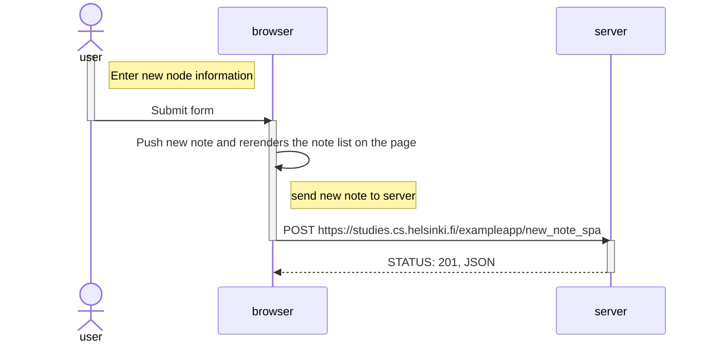

```mermaid

sequenceDiagram
    actor user
    participant browser
    participant server
    
    activate user
    note right of user: Enter new node information
    user->>browser: Submit form
    deactivate user
    
    activate browser
    browser->>browser: Push new note and rerenders the note list on the page
    note right of browser: send new note to server
    browser->>server: POST https://studies.cs.helsinki.fi/exampleapp/new_note_spa
    deactivate browser
    activate server
    server-->>browser: STATUS: 201, JSON
    deactivate server


```
